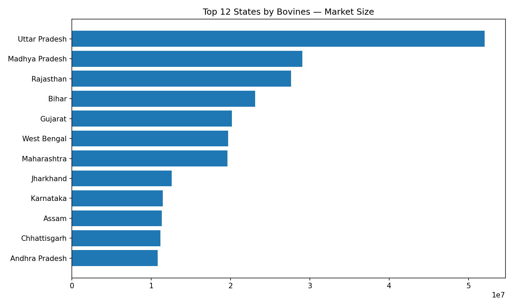
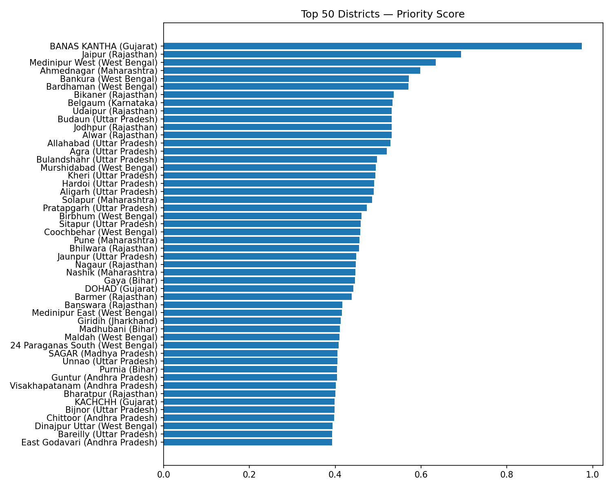
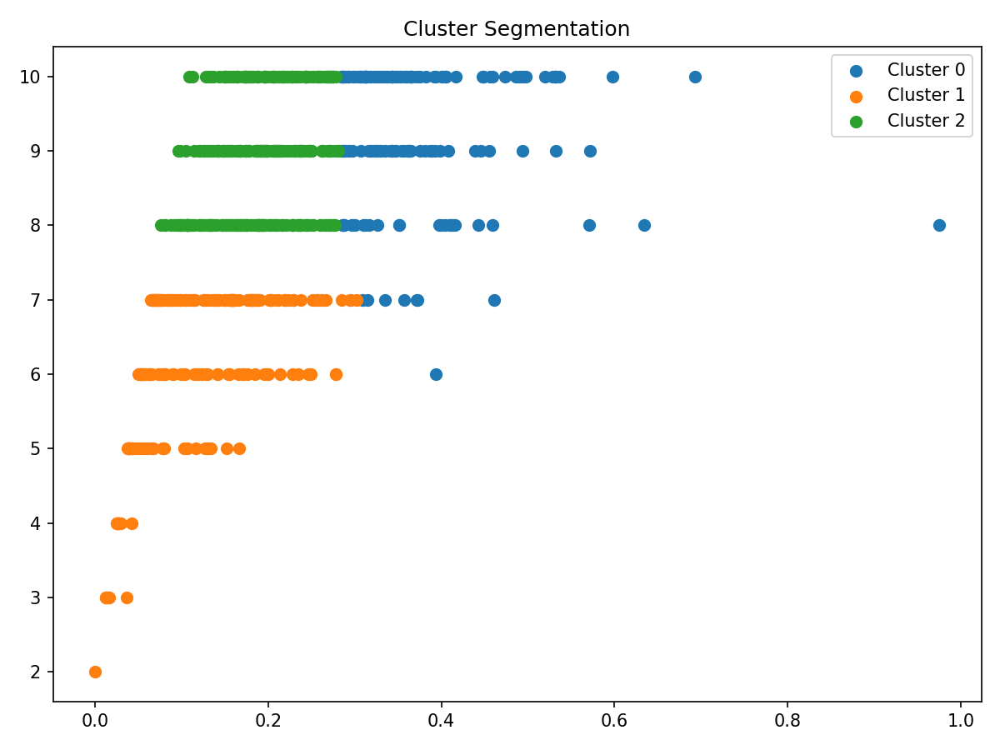

# 🐄 FarmGuardian — Cattle of India 2019 Analysis
### Data-Driven Market Targeting for Livestock Management App Deployment

FarmGuardian aims to provide smart livestock management solutions to farmers, cooperatives, and veterinary institutions.  
This project analyzes the **2019 India Livestock Census** to identify:

- 📍 *Which states and districts have the highest cattle & buffalo populations*  
- 🎯 *Where the FarmGuardian app will achieve maximum adoption*  
- 🧠 *What customer segments exist based on herd size & species diversity*  
- 🚀 *Which regions to target for pilot launch and early users*

All analytics were generated using **Python + Pandas + Matplotlib + Scikit-learn** in Google Colab.

---

## 📁 Repository Contents

| File | Description |
|------|-------------|
| `top50_districts_priority.csv` | Ranked top districts (based on priority score) |
| `district_segments.csv` | Cluster labels for each district (Segment 1/2/3) |
| `top12_states.png` | Visualization: top states by bovine population |
| `top50_districts_bar.png` | Visualization: highest priority districts |
| `cluster_scatter.png` | Visualization: clustering results |
| `farmguardian_notebook.ipynb` | Full analysis notebook |

---

## 📊 Visual Insights (Preview)

### **1. Top 12 States by Bovine Population**

---

### **2. Top 50 Priority Districts**

---

### **3. Clustering — Customer Segments**

---

## 🧠 Business Insights Summary

### **⭐ 1. Best States to Launch FarmGuardian**
States with the highest total bovine populations:

- **Uttar Pradesh**
- **Rajasthan**
- **Madhya Pradesh**
- **Gujarat**
- **Maharashtra**
- **Andhra Pradesh**
- **Karnataka**
- **Bihar**

These states have **large cattle populations**, indicating:
- Bigger customer base  
- Higher chance of commercial-scale operations  
- More farmers likely to adopt digital livestock tools  

---

### **⭐ 2. Priority Districts (Top 50)**
Districts were ranked using:
priority_score =
(0.6 × bovine density) +
(0.3 × herd size) +
(0.1 × species richness)

High-ranking districts:
- Have large, commercial-scale herds  
- Show multi-species diversity  
- Are ideal for **pilot deployment**  
- Strong candidates for **vet partnerships**, **cooperative onboarding**, and **first app adoption**  

---

### **⭐ 3. Customer Segments (Using K-Means)**

| Segment | Characteristics | Recommendation |
|--------|------------------|---------------|
| **Segment 1 — High Priority** | Large herds, high density | 🚀 Launch here first |
| **Segment 2 — Mid Priority** | Average herd size | 📈 Standard rollout |
| **Segment 3 — Low Priority** | Low livestock count | 🕒 Long-term expansion |

Segment 1 districts give the **highest ROI** for early expansion.

---

## 🧪 Technical Stack

### **Python**
- Pandas  
- NumPy  
- Scikit-learn  
- Matplotlib  

### **Machine Learning**
- K-Means clustering  
- MinMax normalization  
- Multi-factor scoring metric  

### **Workflow**
- Clean & standardize census data  
- Create engineered features  
- Aggregate at district level  
- Score using weighted metrics  
- Cluster using K-Means  
- Visualize results  
- Export priority reports  

---

👤 Author

Ishaan Saxena
FarmGuardian — Livestock Data & Market Insights
MIT-WPU | Python | Data Analytics
